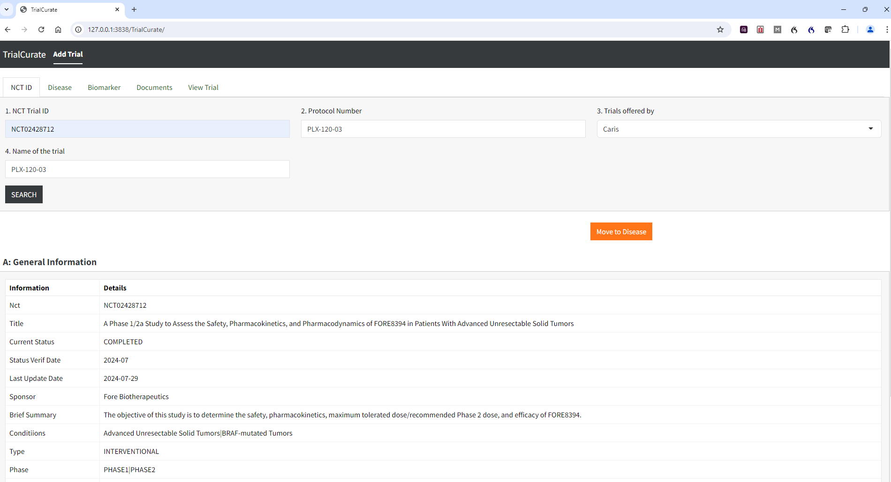

# CancerTrialMatch
TrialCurate, TrialEdit, TrialBrowse are the three shiny interfaces to curate, edit and search clinical trials. 

The source code for the three shiny interfaces: TrialCurate, TrialEdit, TrialBrowse are available at

[TrialCurate] (https://github.com/AveraSD/TrialCurate)

[TrialEdit] (https://github.com/AveraSD/TrialEdit)

[TrialBrowse] (https://github.com/AveraSD/TrialBrowse)

Examples of NCT identifiers to use for curation : NCT02428712, NCT03662126, NCT05361395 

Install Docker desktop and enable WSL integration in case of windows.

All the three shiny app interfaces are dockerized. 

Instructions to build and test docker images using the command line are as follows:

**Go to the folder where docker-compose is located and type**

```docker-compose up --build```

**To check docker images:**

```docker ps```

**Access the Shiny apps through a web browser at:**

[TrialCurate] http://127.0.0.1:3838/TrialCurate/

[TrialEdit] http://127.0.0.1:3838/TrialEdit/

[TrialBrowse] http://127.0.0.1:3838/TrialBrowse/


**To remove and clean up docker images, containers, builds etc.**

```docker-compose down -v```

### Screenshots for TrialCurate interface ###




**Check curation results**

#### To check if the clinical trial you curated is saved correctly and exists in mongo database, check by doing #### 

```docker exec -it mongocontainerid mongosh```

This takes you inside the mongo database interface. Then type the following commands at the prompt:

(aci is database name and ClinicalTrials is collection name)

```use aci```

```db.ClinicalTrials.countDocuments()```

You should see 1.

```db.ClinicalTrials.find({“info.NCT”: “yourNCTid”})```

This should show the complete information for the curated clinical trial. 

#### To edit a clinical trial ####

### Screenshots for TrialEdit interface ###

**Check any edited trial**

- Repeat the same steps as above you did to check the newly curated trial. You will see the change you saved for the selected clinical trial in the mongo database. 
- You can also check directly in the TrialEdit interface by clicking the trial and looking at the two tabs Trial Part 1 and Trial Part 2.

#### To browse clinical trials ####

### Screenshots for TrialBrowse interface ###

**Check clinical trials using TrialBrowse interface**

This app when invoked will load few trials from the database. 

- To check just load the page using the URL. 
- Once it is loaded, click on the hamburger icon and this opens the sidebar and shows the search menu. 
- Enter values for the different search criteria and filter will show the trials in the table on the right.
- Click on Reset trials clears the results.
- You can expand information to read more details for each trial and also look at the closed trials by clicking on show closed trials checkbox.
- Search bar on the top right helps to search the full table with a keyword.
