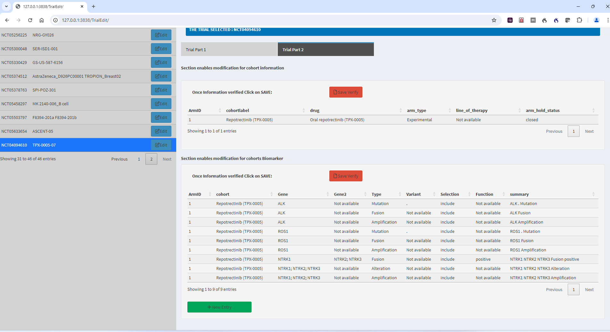

# CancerTrialMatch

TrialCurate, TrialEdit, TrialBrowse are the three shiny interfaces to curate, edit and search clinical trials. 

The source code for the three shiny interfaces: TrialCurate, TrialEdit, TrialBrowse are available at

[TrialCurate] (https://github.com/AveraSD/CancerTrialMatch/TrialCurate)

[TrialEdit] (https://github.com/AveraSD/CancerTrialMatch/TrialEdit)

[TrialBrowse] (https://github.com/AveraSD/CancerTrialMatch/TrialBrowse)

Examples of NCT identifiers to use for curation : NCT02428712, NCT03662126, NCT05361395 

Install Docker desktop and enable WSL integration in case of windows.

All the three shiny app interfaces are dockerized. 

Instructions to build and test docker images using the command line are as follows:

**Go to the main folder where Dockerfile is located and do:**

```docker build -t shiny-apps . ```

**Go to the main folder where docker-compose is located and do:**

```docker-compose up --build```

**To check docker images:**

```docker ps```

**To check docker containers:**

```docker ps -a```

**Access the Shiny apps through a web browser at:**

[TrialCurate] http://127.0.0.1/TrialCurate/

[TrialEdit] http://127.0.0.1/TrialEdit/

[TrialBrowse] http://127.0.0.1/TrialBrowse/


**To remove and clean up docker images, containers, builds etc.**

```docker-compose down -v```

### How to curate using TrialCurate interface ###

**Connect to clinicaltrials.gov API**


**Disease and stage**


**Line of therapy and arm status**


**Biomarkers**


**Biomarkers details**


**Documentation**


**Overview and confirm**


**Check curation results**

#### To check if the clinical trial you curated is saved correctly and exists in mongo database, check by doing #### 

```docker exec -it mongocontainerid mongosh```

This takes you inside the mongo database interface. Then type the following commands at the prompt:

(aci is database name and ClinicalTrials is collection name)

```use aci```

```db.ClinicalTrials.countDocuments()```

You should see 1.

```db.ClinicalTrials.find({“info.NCT”: “yourNCTid”})```

This should show the complete information for the curated clinical trial. 

#### To edit a clinical trial ####

### How to edit existing trials using TrialEdit interface ###

**Select trial to edit**

There are two parts: Trial Part I (consists of 4 sections) and Trial Part 2 (consists of 2 sections) and a submit button on the top of the page to finally submit the trial after making changes.

Each section has a table and click on any cell inside the table where you need to make a change and then click on "Save Verify" button to save the change you made.

In case you do not have any change in any section, **you still** have to click on "Save Verify" button in each section. 

Click on "Save Verify" button on all sections and then hit the "Submit button" on the top of the page to save the trial to the database. This will avoid "Disconnected from the server" error.


**Trial Part I**


**Trial Part I**


**Trial Part II**



**Check any edited trial**

- Repeat the same steps as above you did to check the newly curated trial. You will see the change you saved for the selected clinical trial in the mongo database. 
- You can also check directly in the TrialEdit interface by clicking the trial and looking at the two tabs Trial Part 1 and Trial Part 2.

#### To browse clinical trials ####

### How to browse trials using TrialBrowse interface ###

**Browse main display**


**Browse with sidebar menu**


**Browse with closed trials**


**Use search criteria**


**Browse with column selection**


**Browse with search box**


**Check clinical trials using TrialBrowse interface**

This app when invoked will load few trials from the database. 

- To check just load the page using the URL. 
- Once it is loaded, click on the hamburger icon and this opens the sidebar and shows the search menu. 
- Enter values for the different search criteria and filter will show the trials in the table on the right.
- Click on Reset trials clears the results.
- You can expand information to read more details for each trial and also look at the closed trials by clicking on show closed trials checkbox.
- Search bar on the top right helps to search the full table with a keyword.
